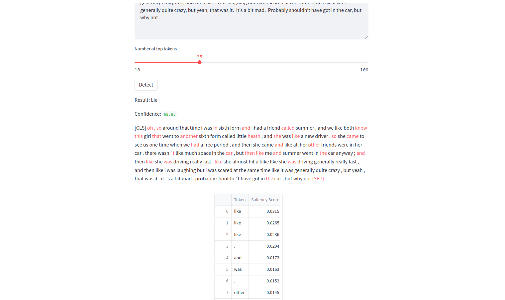

# Defence argument classifier

This web application uses AI-powered natural language processing to analyse legal defense arguments and uncover the truth. It provides lie detection results (truthful or not) and highlights the words that mostly affect the outcome.

## Features

- Binary classification of defense arguments.
- Confidence score for the classification.
- Explainability through highlighting of important words that affect the outcome.
- User-friendly interface.
- Based on a state-of-the-art fine-tuned DistilBERT model for classification and saliency analysis.

## Preview

## Usage

1. Enter a defense argument without using quotation marks.
2. Alternatively select an argument from the provided list.
3. Click the "Detect" button to obtain the lie detection outcome.
4. The result (Truth or Lie) and the confidence score are displayed.
5. Use the slider to select the number of most important words you want highlighted.
6. The words are highlighted in the text below to visualise saliency.
7. (NEW) A table with the saliency score of each token is displayed under the highlighted text.

## Installation

1. Create and activate a Python environment
    (e.g., on Linux):
    - `python -m venv ENV_NAME`
    - `source ENV_NAME/bin/activate`

2. Install the required Python packages using `pip install -r r.txt`.

3. Run the following command:
    `python -m streamlit run main.py`

## How It Works

The lie detection model is powered by the DistilBERT model, which is fine-tuned for binary classification on a curated dataset of defense arguments. It also calculates the saliency of words in the input text to highlight the most important terms for the decision.

## Contributing

Feel free to contribute to this project by opening issues or submitting pull requests.

## License

This project is licensed under the MIT License.

## Acknowledgments

This application was developed as part of our research in the field of NLP. It serves as a demonstration in the context our publication.
<!-- If you find this application useful in your work, please consider citing our scientific paper for reference: -->

## Try it 
You can access the live version of the app here: [Live Demo](https://defence-argument-classification.streamlit.app/)