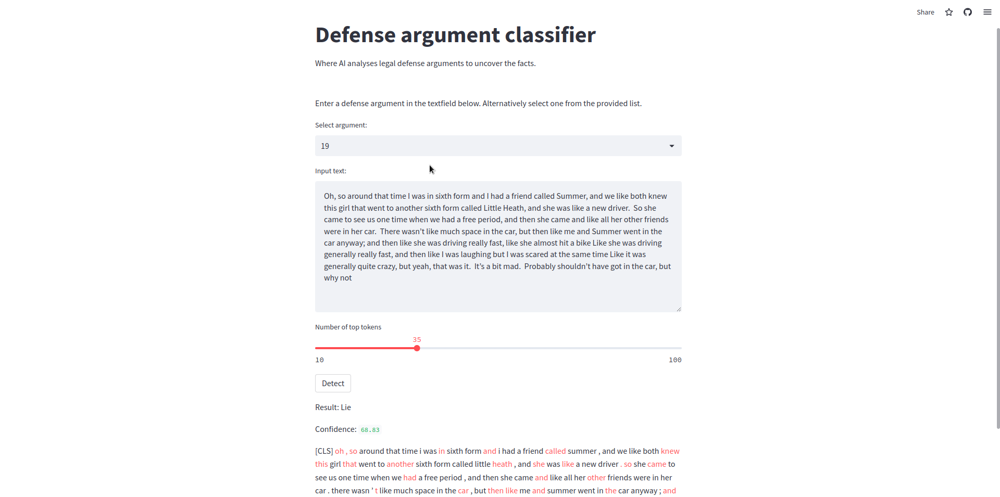

# Lie Detection in defense arguments with AI

This web application uses AI-powered natural language processing to analyse legal defense arguments and uncover the truth. It provides lie detection results (truthful or not) and highlights the words that mostly affect the outcome.

## Features

- Classification of defense arguments.
- Confidence score for the results.
- Highlighting of important words in the provided text.
- User-friendly web interface.
- Utilises a state-of-the-art DistilBERT model for classification and saliency analysis.

## Preview

## Usage

1. Enter a defense argument without using quotation marks.
2. Click the "Detect" button to obtain lie detection results.
3. The result (True or False) and the confidence score are displayed.
4. Use the slider to select the number of most important words you want highlighted.
5. Important words are highlighted in the input text to visualise saliency.

## Installation

1. Create and activate a Python environment
    (e.g., on Linux):
    - `python -m venv ENV_NAME`
    - `source ENV_NAME/bin/activate`

2. Install the required Python packages using `pip install -r r.txt`.

3. Run the following command:
    `python -m streamlit run main.py`

## How It Works

The lie detection model is powered by the DistilBERT model, which is fine-tuned for binary classification on a curated dataset of defense arguments. It also calculates the saliency of words in the input text to highlight the most important terms for the decision.

## Contributing

Feel free to contribute to this project by opening issues or submitting pull requests.

## License

This project is licensed under the MIT License - see the [LICENSE](LICENSE) file for details.

## Acknowledgments

This web app was created for educational purposes and to accompany our publication.

## Try it 
You can access the live version of the app here: [Live Demo](https://defence-argument-classification.streamlit.app/)